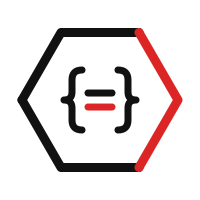

<p align="center">
  
</p>

<h1 align="center">Ovaso</h1>

<p align="center">
  Free, open-source REST API to verify businesses registered in Trinidad & Tobago.
  <br />
  <a href="https://ovaso.vercel.app"><strong>Website</strong></a> · <a href="https://ovaso.vercel.app/docs"><strong>Docs</strong></a>
</p>

<p align="center">
  
  
  
</p>

---

## What is this?

Trinidad & Tobago has no public API for its business registry. The only way to check if a company is registered is through the [RGD website](https://rgd.legalaffairs.gov.tt/ttNameSearch/), which is a clunky web app with no programmatic access.

**Ovaso wraps the RGD registry in a clean REST API** so developers, startups, and anyone in T&T can verify business registrations from their own apps — for free, with zero sign-up.

## Quick start

No API key. No sign-up. Just fetch.

```bash
# Check if a business is registered
curl "https://ovaso.onrender.com/check?name=guardian+holdings+limited"

# Search companies by name
curl "https://ovaso.onrender.com/search?name=massy"

# Search name reservations
curl "https://ovaso.onrender.com/reservations?name=island"
```

### JavaScript

```js
const res = await fetch(
  "https://ovaso.onrender.com/check?name=guardian+holdings+limited"
);
const data = await res.json();

if (data.is_registered) {
  console.log("Registered:", data.exact_matches[0].company_name);
}
```

### Python

```python
import requests

res = requests.get(
    "https://ovaso.onrender.com/check",
    params={"name": "guardian holdings limited"}
)
data = res.json()

if data["is_registered"]:
    print("Registered:", data["exact_matches"][0]["company_name"])
```

## Endpoints

| Method | Path | Description |
|--------|------|-------------|
| `GET` | `/check?name=` | Check if a business name is registered (recommended) |
| `GET` | `/search?name=` | Search registered companies |
| `GET` | `/reservations?name=` | Search name reservations |
| `GET` | `/health` | API health check |

All endpoints return JSON. See the [full documentation](https://ovaso.onrender.com/docs) for response schemas and examples.

## Example response

```json
{
  "query": "guardian holdings limited",
  "is_registered": true,
  "exact_matches": [
    {
      "company_name": "GUARDIAN HOLDINGS LIMITED",
      "company_number": "G967(C)",
      "record_type": "PROFIT COMPANY",
      "record_status": "ACTIVE (CONTINUED)",
      "registration_date": "14/04/1998",
      "street_address": "1 GUARDIAN DRIVE",
      "state": "WESTMOORINGS"
    }
  ],
  "similar_matches": [],
  "reserved_names": []
}
```

## Rate limits

- **30 requests/minute** per IP
- Responses cached for 5 minutes server-side
- Cached responses don't count toward the rate limit

> **Note:** The API runs on a free-tier server that sleeps after 15 minutes of inactivity. The first request after a cold start may take ~30 seconds. Subsequent requests are fast. If there's enough demand, I'll upgrade to an always-on instance.

## Self-hosting

If you want to run your own instance:

### Prerequisites

- Python 3.12+
- Node.js 20+ (for the frontend)

### Run locally

```bash
# Clone the repo
git clone https://github.com/Joshva02/ovaso.git
cd ovaso

# Backend
python -m venv venv
source venv/bin/activate
pip install -r requirements.txt
uvicorn app.main:app --port 8000

# Frontend (in a separate terminal)
cd web
npm install
npm run dev
```

### Docker

```bash
docker build -t ovaso .
docker run -p 8000:8000 ovaso
```

### Run tests

```bash
pytest tests/ -v
```

## Tech stack

| Layer | Tech |
|-------|------|
| API | Python, FastAPI, httpx |
| Frontend | React, TypeScript, Vite, Tailwind CSS v4 |
| Caching | In-memory async TTL cache |
| Rate limiting | slowapi (30 req/min per IP) |
| Logging | structlog (JSON) |
| CI | GitHub Actions |
| Container | Docker (multi-stage build) |

## Project structure

```
ovaso/
├── app/
│   ├── main.py          # FastAPI app, endpoints, middleware
│   ├── client.py         # RGD registry client (httpx + JWT session)
│   ├── models.py         # Pydantic models
│   ├── cache.py          # Async TTL cache
│   └── logging.py        # structlog config
├── web/
│   ├── src/
│   │   ├── components/   # React components
│   │   ├── pages/        # Home + Docs pages
│   │   ├── hooks/        # Theme, API playground hooks
│   │   └── utils/        # API client, constants, config
│   └── public/           # Static assets, logo
├── tests/                # pytest test suite
├── Dockerfile            # Multi-stage build
├── docker-compose.yml
└── .github/workflows/    # CI pipeline
```

## Contributing

Contributions welcome. Open an issue or submit a PR.

If you build something with Ovaso, tag [@Joshva02](https://github.com/Joshva02) — would love to see it.

## License

MIT

## Disclaimer

Data is sourced from the [Registrar General's Department](https://rgd.legalaffairs.gov.tt/ttNameSearch/). This project is open source and has no affiliation with the Government of Trinidad & Tobago.
